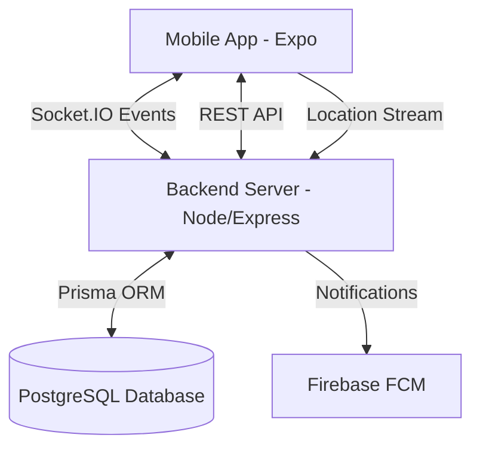
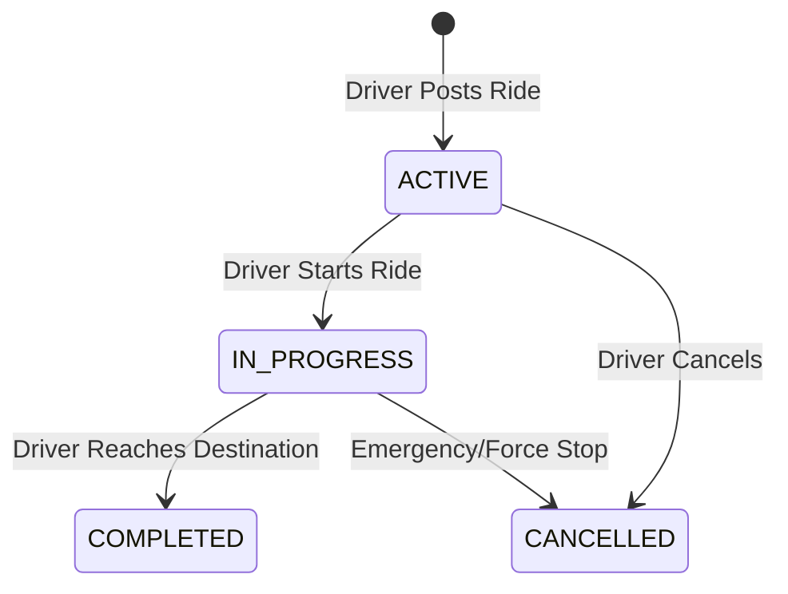

# ChalParo (چل پاڑو) — Technical Architecture & Documentation

> **Saath Chalein, Saath Bachaein**  
> *The ultimate real-time carpooling infrastructure for Pakistan.*

---

## 🏗️ System Architecture

ChalParo is built on a **Real-time Event-Driven Architecture (REDA)**. The system is designed to maintain high consistency between the Driver and Passenger interfaces without manual refreshes.



---

## 🛠️ Tech Stack & Key Modules

### Frontend (Expo SDK 54+)
- **State Management**: Context-based `SocketDataContext` (Global Real-time Feed).
- **Real-time Hub**: `SocketListener` component with stable handler references for perfect event capture.
- **Animations**: `React-native-reanimated` (New Architecture) with custom Babel configuration for production stability.
- **Maps**: WebView-hosted Leaflet engine for lightweight, performant route tracking.

### Backend (Node.js/TypeScript)
- **Engine**: Express with focused middleware (Helmet, Rate-limit, Morgan).
- **ORM**: Prisma for type-safe database interactions with PostgreSQL.
- **Broadcasting**: Custom `broadcastEvent` and `emitToRideRoom` helpers for granular real-time updates.

---

## 🔄 Business Logic & Lifecycles

### 1. Ride Lifecycle State Machine
A ride's status is critical for visibility and synchronization.



### 2. The Booking Flow (Handshake)
1. **Passenger**: Sends `BOOKING_REQUESTED` via API.
2. **Server**: Emits `BOOKING_REQUESTED` to Driver's private room.
3. **Driver Dashboard**: Real-time "New Request" indicator appears (Socket Upsert).
4. **Driver Action**: Accepts/Rejects via API.
5. **Server**: Emits `BOOKING_UPDATED` to Passenger and recalculates `bookedSeats`.

---

## 🔌 Real-time Protocol (Socket.IO Map)

| Event Name | Direction | Payload Structure | UI Impact |
| :--- | :--- | :--- | :--- |
| `NEW_RIDE` | Server -> All | `Ride` object (Full) | Injects new card into `SearchScreen` feed immediately. |
| `BOOKING_REQUESTED` | Server -> Driver | `{ rideId, bookedSeats, booking }` | Increments seat count & shows badge on Driver's ride list. |
| `LOCATION_UPDATE` | Driver -> Ride Room | `{ rideId, latitude, longitude, ... }` | Moves driver icon on Passenger’s live tracking map. |
| `RIDE_STARTED` | Server -> Passengers| `{ rideId, status: 'IN_PROGRESS' }` | Switches Passenger’s Booking card to "Live Tracking" mode. |
| `RIDE_COMPLETED` | Server -> Passengers| `{ rideId, status: 'COMPLETED' }` | Triggers "Rate your Driver" modal on Passenger UI. |

---

## 🗄️ Database Modeling (Entity Relationships)

### Core Models:
- **`User`**: Central identity with `role` (DRIVER/PASSENGER), `avgRating`, and `isVerified`.
- **`Ride`**: The anchor entity. Stores route, stops (JSON), and `bookedSeats`.
- **`Booking`**: Junction between `User` and `Ride`. Tracks `boardingCity` and `exitCity` for segment-based booking.
- **`Vehicle`**: Associated with Driver. Stores amenities (AC, Wifi, etc.) used for search filtering.

---

## ⚙️ Critical Setup & Configuration

### 1. Version Stability (Pre-flight Required)
The project uses specific versions to ensure EAS Build stability:
- **React**: `19.1.0`
- **React Native**: `0.81.5`
- **Babel**: Must include `'react-native-reanimated/plugin'`.

### 2. Network Handling
Network calls are centralized in `src/config/network.ts`.
- **Development**: Set to your local workstation IP.
- **Production**: Set to `https://carpool-v1.bonto.run`.

### 3. Native APK Generation
To generate a downloadable APK using EAS:
```bash
eas build --platform android --profile preview
```
*Note: The `preview` profile is configured in `eas.json` with `buildType: "apk"`.*

---

## 🧠 "Intelligent Sync" Logic
The application uses a **Virtual Merger** in the search screen:
- When a `NEW_RIDE` event arrives, the app doesn't just add it; it checks if the ride matches the user's current city filters.
- If it matches and isn't already in the list, it's **prepended** at the top with a highlight.
- This ensures users see the most recent rides without ever pulling-to-refresh.

---

*Made in Pakistan 🇵🇰 — ChalParo v1.0 Technical Manual*
