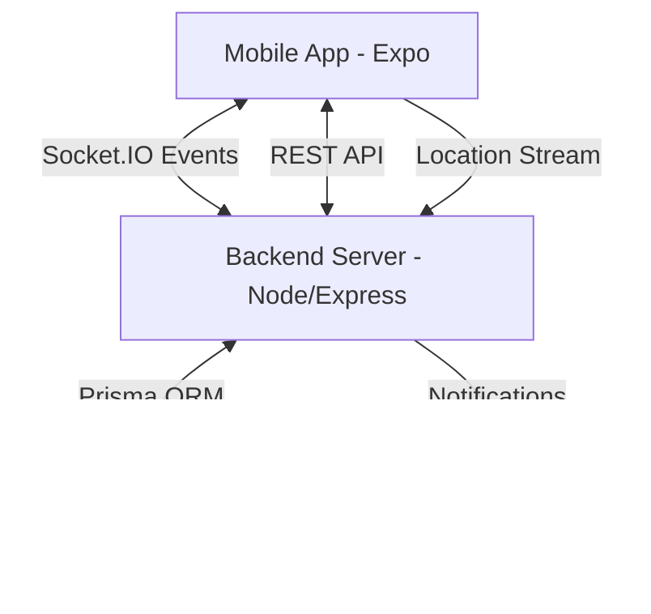
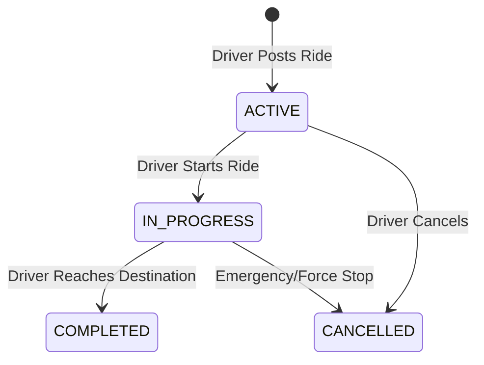

# ChalParo (چل پاڑو) — Technical Architecture & Documentation

> **Saath Chalein, Saath Bachaein**  
> *The ultimate real-time carpooling infrastructure for Pakistan.*

---

## 🏗️ System Architecture

ChalParo is built on a **Real-time Event-Driven Architecture (REDA)**. The system is designed to maintain high consistency between the Driver and Passenger interfaces without manual refreshes.


```mermaid
graph TD
    A[Mobile App - Expo] <-->|Socket.IO Events| B[Backend Server - Node/Express]
    A <-->|REST API| B
    B <-->|Prisma ORM| C[(PostgreSQL Database)]
    B -->|Notifications| D[Firebase FCM]
    A -->|Location Stream| B
```

---

## 🛠️ Tech Stack & Key Modules

### Frontend (Expo SDK 54+)
- **State Management**: Context-based `SocketDataContext` (Global Real-time Feed).
- **Real-time Hub**: `SocketListener` component with stable handler references for perfect event capture.
- **Animations**: `React-native-reanimated` (New Architecture) with custom Babel configuration for production stability.
- **Maps**: WebView-hosted Leaflet engine for lightweight, performant route tracking.

### Backend (Node.js/TypeScript)
- **Engine**: Express with focused middleware (Helmet, Rate-limit, Morgan).
- **ORM**: Prisma for type-safe database interactions with PostgreSQL.
- **Broadcasting**: Custom `broadcastEvent` and `emitToRideRoom` helpers for granular real-time updates.

---

## 🔄 Business Logic & Lifecycles

### 1. Ride Lifecycle State Machine
A ride's status is critical for visibility and synchronization.


```mermaid
stateDiagram-v2
    [*] --> ACTIVE: Driver Posts Ride
    ACTIVE --> IN_PROGRESS: Driver Starts Ride
    IN_PROGRESS --> COMPLETED: Driver Reaches Destination
    ACTIVE --> CANCELLED: Driver Cancels
    IN_PROGRESS --> CANCELLED: Emergency/Force Stop
```

### 2. The Booking Flow (Handshake)
1. **Passenger**: Sends `BOOKING_REQUESTED` via API.
2. **Server**: Emits `BOOKING_REQUESTED` to Driver's private room.
3. **Driver Dashboard**: Real-time "New Request" indicator appears (Socket Upsert).
4. **Driver Action**: Accepts/Rejects via API.
5. **Server**: Emits `BOOKING_UPDATED` to Passenger and recalculates `bookedSeats`.

---

## 🔌 Real-time Protocol (Socket.IO Map)

| Event Name | Direction | Payload Structure | UI Impact |
| :--- | :--- | :--- | :--- |
| `NEW_RIDE` | Server -> All | `Ride` object (Full) | Injects new card into `SearchScreen` feed immediately. |
| `BOOKING_REQUESTED` | Server -> Driver | `{ rideId, bookedSeats, booking }` | Increments seat count & shows badge on Driver's ride list. |
| `LOCATION_UPDATE` | Driver -> Ride Room | `{ rideId, latitude, longitude, ... }` | Moves driver icon on Passenger’s live tracking map. |
| `RIDE_STARTED` | Server -> Passengers| `{ rideId, status: 'IN_PROGRESS' }` | Switches Passenger’s Booking card to "Live Tracking" mode. |
| `RIDE_COMPLETED` | Server -> Passengers| `{ rideId, status: 'COMPLETED' }` | Triggers "Rate your Driver" modal on Passenger UI. |

---

## 🗄️ Database Modeling (Entity Relationships)

### Core Models:
- **`User`**: Central identity with `role` (DRIVER/PASSENGER), `avgRating`, and `isVerified`.
- **`Ride`**: The anchor entity. Stores route, stops (JSON), and `bookedSeats`.
- **`Booking`**: Junction between `User` and `Ride`. Tracks `boardingCity` and `exitCity` for segment-based booking.
- **`Vehicle`**: Associated with Driver. Stores amenities (AC, Wifi, etc.) used for search filtering.

---

## ⚙️ Critical Setup & Configuration

### 1. Version Stability (Pre-flight Required)
The project uses specific versions to ensure EAS Build stability:
- **React**: `19.1.0`
- **React Native**: `0.81.5`
- **Babel**: Must include `'react-native-reanimated/plugin'`.

### 2. Network Handling
Network calls are centralized in `src/config/network.ts`.
- **Development**: Set to your local workstation IP.
- **Production**: Set to `https://carpool-v1.bonto.run`.

### 3. Native APK Generation
To generate a downloadable APK using EAS:
```bash
eas build --platform android --profile preview
```
*Note: The `preview` profile is configured in `eas.json` with `buildType: "apk"`.*

---

## 🧠 "Intelligent Sync" Logic
The application uses a **Virtual Merger** in the search screen:
- When a `NEW_RIDE` event arrives, the app doesn't just add it; it checks if the ride matches the user's current city filters.
- If it matches and isn't already in the list, it's **prepended** at the top with a highlight.
- This ensures users see the most recent rides without ever pulling-to-refresh.

---

*Made in Pakistan 🇵🇰 — ChalParo v1.0 Technical Manual*


# CLAUDE.md — ChalParo

Guidance for AI-assisted work in this repo. Read this before making changes.

## What this is
**ChalParo** (چل پاڑو) — a real-time carpooling app for Pakistan. Two repos work together:

| Repo | Path | Stack |
|---|---|---|
| **App (client)** | `D:\projects\carpool\app` | Expo SDK 54, React Native 0.81, React 19, TypeScript |
| **Backend (server)** | `D:\projects\app-server` | Express 5 + TypeScript, Prisma 7 + PostgreSQL (Neon), Socket.IO, Redis, deployed on Fly.io (`app-server-t62hcw.fly.dev`) |

The app talks to the backend over **REST** (`/api/v1`) and **Socket.IO** (live rides, chat, location).

## App architecture (the part you'll touch most)
- **State**: React Context, not Redux. Key providers in `app/src/context/`:
  - `AppContext` — auth/user, core actions.
  - `SocketDataContext` — real-time feeds (bookings, rides, requests) with AsyncStorage caching.
  - `ToastContext`, `GlobalModalContext`, `BannerContext` — overlays.
- **Real-time hub**: `app/src/components/SocketListener.tsx` — a single always-mounted component that owns every socket handler. Register new socket events here (define handler in the `handlers` object, then `on`/`off` it in the two lists). **All `.on()` calls must run after `socketService.connect()` resolves** (connect is async — it awaits the token).
- **API layer**: `app/src/services/api.tsx` — a custom fetch client (not axios) with SecureStore tokens + a refresh mutex. Grouped modules: `authApi`, `ridesApi`, `bookingsApi`, `vehiclesApi`, `profileApi`, `notificationsApi`, `scheduleRequestsApi`, `reviewsApi`, `trackingApi`.
- **Navigation**: `app/src/navigation/AppNavigator.tsx` — role-based (5 passenger tabs vs 5 driver tabs), each tab its own native stack, custom SVG tab bar.
- **Styling**: plain `StyleSheet` + centralized theme in `app/src/components` (`COLORS`, `GRADIENTS`, `SPACING`, etc.). Primary color `#0d1b4b`. **No** NativeWind/styled-components.

## Ride start → end flow (live tracking)
Fully wired across both repos. See README.md "Ride Start → End Flow" for the blow-by-blow. Key files:
- Driver start: `app/src/screens/driver/ActiveRidesScreen.tsx`
- Live tracking (driver + passenger, same screen): `app/src/screens/driver/RideTrackingScreen.tsx`
- Background GPS task: `app/src/tasks/locationTask.ts` (registered by a side-effect `import` in `App.tsx`)
- Socket handling: `app/src/components/SocketListener.tsx` (`onRideStarted`, `onRideCompleted`)
- Backend state machine: `app-server/src/services/ride.service.ts` (`updateStatus`, `cancelRide`)
- Backend location: `app-server/src/services/location.service.ts`, `app-server/src/socket.ts`, `app-server/src/controllers/tracking.controller.ts`

Location is **hybrid**: foreground uses the `location-update` socket event directly; background uses the OS task → `POST /tracking/update-location` → server relays to the ride room.

## Gotchas / conventions
- **`network.ts` exports both `SERVER_URL` and `API_BASE_URL`** (`${SERVER_URL}/api/v1`). `api.tsx` and `locationTask.ts` import `API_BASE_URL` — don't remove it.
- **Background location = native config.** Changes to `app.json` (permissions, `expo-location` plugin, iOS `UIBackgroundModes`) require a **new dev/EAS build**. They do NOT apply via OTA update or Expo Go.
- **Branch `app-convert-to-tsx`**: the app is mid-migration from `.js` to `.tsx`. Types are loose in places (`any` is common). `tsc --noEmit` reports pre-existing errors across the codebase — when verifying a change, filter to the files you touched.
- No test suite and no lint script are configured. Verify with `npx tsc --noEmit` (scoped) and by running the app (`npm start` in `app/`).
- Socket event names are SCREAMING_CASE (`RIDE_STARTED`) **except** the high-frequency `location-update` (kebab-case).
- Notifications go out three ways from the backend: DB row (in-app inbox) + FCM push + socket emit — see `app-server/src/utils/notificationDispatcher.ts`.

## Design rule
Replicate provided design references exactly — do not add or remove UI beyond what's specified.
